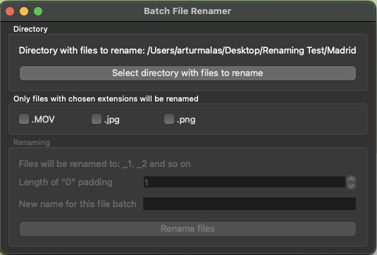
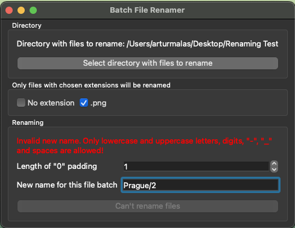

# Disclaimer
> WARNING: This software is not a finished product and may cause irreversible damage to files and even the whole operating system.
Please note that neither the main developer nor any contributors take any reponsibility for damage that may be caused by using this software.
Use it at your own responsibility and exercise caution.

# How to use
1. Install Python 3.12 or higher
2. Install `poetry` dependency management tool
3. Download the software from the repository by running the command below 
```
git clone https://github.com/Artur-T-Malas/batch-file-renamer.git
```
4. Install the necessary dependencies by running the following command
```
poetry install
```
5. Open a terminal and navigate to the application's root directory and run the following commands if you're on Windows
```
.venv/Scripts/activate
python main.py
```
or the commands below if you're using a Mac or Linux-based computer
```
source .venv/bin/activate
python main.py
```


# Renaming Logic
For all examples below, let’s assume that user chose the new name to be `Holidays` and the number of digit characters to `3`.

Script will always try to rename files to `new-name_i.extension`, with `i` being the next value starting from „1” (may include leading 0s based on user’s choice). The input list of files (read from directory) will be sorted by file names with some exceptions.

Before attempting to rename files, Batch File Renamer will scan the directory for files which already have a name that matches the desired pattern, which in our example would be anything that starts with `Holidays_` and has 3 digits after that and an optional extension. This operation uses Python's built in `re` module for regex pattern matching.

If some files matching the pattern were found, the application will also check if they have numbers matching the correct range (from 1 to number of files being renamed).

If such files are found, they will not be subject to renaming, and their numbers will be removed from the numbers pool used by the application. This is visible in the 2nd example below.

Because of this, some files' numbers may not correspond to their place in the alphabeticaly sorted list of files. However, all files that will be renamed, will retain their order with regards to each other.

This change in logic was made to prevent the situation from the previous version of the Batch File Renamer, when some files could already have a name which script was going to give to another file, which could greatly mess up numbering and could lead to some files having number higher than the number of files that was being renamed, as well as the general order being way off.

## Examples

### No overlap between current and new names
```
IMG_123.jpg -> Holidays_001.jpg
IMG_234.jpg -> Holidays_002.jpg
IMG_235.jpg -> Holidays_003.jpg
```

### Some files with matching names and both names and numbers
```
ABC_123.jpg         ->  Holidays_002.jpg
Holidays_001.jpg    ->	not renamed
Holidays_2077.v     ->  Holidays_003.v
IMG_234.jpg         ->	Holidays_004.jpg
IMG_235.jpg 	    ->	Holidays_005.jpg
```
As is visible above, all files that were subject to renaming (eveything other than `Holidays_001.jpg`) have retained their relative order after renaming.

## Changelog

### 2025-02-02
1. [Logic] Add REGEX validation to file names, allow only for lowercase/uppercase letters, digits, "-", "_" and spaces
2. [UI] Show an error message in the new name preview if an invalid name was chosen and disable the "Rename files" button



### 2025-02-01
1. [UI] Fix bug which prevented automatic shrinking of the window, after it automatically grew due to a very long file name being shown in the preview

### 2025-01-28
1. [UI] Automatically wrap the extensions list to a maximum of 5 column

### 2025-01-27
1. [UI] Separate extension panel from renaming panel
2. [UI] Add enabling/disabling of extensions panel. It will be disabled until a valid directory / folder is selected. It will get enabled as soon as a valid directory is chosen, and will be again disabled if an invalid directory gets chosen.
2. [UI] Add enabling/disabling of renaming panel. It will be disabled until at least one extension is chosen in the extensions panel. If extensions are deselected it will be disabled again

### 2025-01-26
1. Complete rework of the renaming logic
2. Directories / folders can now be selected by highlighting them as well as opening
3. Added a confirmation dialog after clicking "Rename files" button to confirm execution

### 2024-12-25
1. Directories are now ignored when both looking for extensions and renaming

### 2024-11-27
1. Added extension choosing (only files with one of the chosen extensions will be renamed). The list of available extensions (checkboxes) is generated automatically for any chosen directory/folder

### 2024-11-24
1. Fixed CRITICAL bug causing loss of files if some of the files had names that the script would try to rename other files to, which resulted in overwriting and loss of original files

### 2024-11-21
1. Allow user to define the number of leading 0s (padding) in the file numeration
2. By default apply the padding automatically based on the number of files in the choosen directory

## Features to add
- Be able to select specific files to renames (instead of whole directories) - could be with a switch (radio button) to let user decide whether they want whole directory or just some files
- Add a switch (checkbox maybe or iPhone-like switch) to have the number padding only automatic (disable user input) or forced by user (still the default value will be automatic)
- Add a loader (based on the number of files already renamed vs remaining)
- Have a counter next to each extension to show how many files have that extension
- Add a separate toggle to also rename directories (eg. smth like `isDir` check)

## Known bugs
- None

## Fixes to do
- Reset the "Rename files" button if the input name or extensions selection changes without having to re-choose a directory again
- Instead of showing the message on the "Rename files" button, display a message box showing either the success/failure of renaming operation eg. "Succesfully renamed 2024 of 2025 files"
- Ignore extensions like .DS_Store etc.
- Add typing where possible
- Use logger instead of print functions
- Store logs in a file
