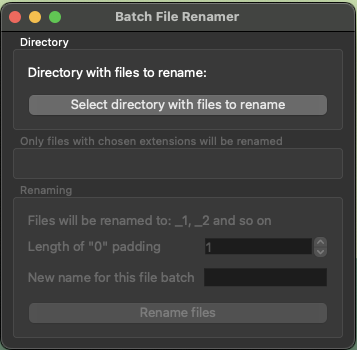
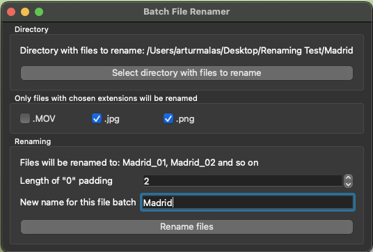

# Renaming Logic
For all examples below, let’s assume that user chose the new name to be `Holidays` and the number of digit characters to `3`.

Script will always try to rename files to `new-name_i.extension`, with `i` being the next value starting from „1” (may include leading 0s based on user’s choice). The input list of files (read from directory) will be sorted by file names with some exceptions.

Before attempting to rename files, Batch File Renamer will scan the directory for files which already have a name that matches the desired pattern, which in our example would be anything that starts with `Holidays_` and has 3 digits after that and an optional extension. This operation uses Python's built in `re` module for regex pattern matching.

If some files matching the pattern were found, the application will also check if they have numbers matching the correct range (from 1 to number of files being renamed).

If such files are found, they will not be subject to renaming, and their numbers will be removed from the numbers pool used by the application. This is visible in the 2nd example below.

Because of this, some files' numbers may not correspond to their place in the alphabeticaly sorted list of files. However, all files that will be renamed, will retain their order with regards to each other.

This change in logic was made to prevent the situation from the previous version of the Batch File Renamer, when some files could already have a name which script was going to give to another file, which could greatly mess up numbering and could lead to some files having number higher than the number of files that was being renamed, as well as the general order being way off.

## Examples

### No overlap between current and new names
```
IMG_123.jpg -> Holidays_001.jpg
IMG_234.jpg -> Holidays_002.jpg
IMG_235.jpg -> Holidays_003.jpg
```

### Some files with matching names and both names numbers
```
ABC_123.jpg         ->  Holidays_002.jpg
Holidays_001.jpg    ->	not renamed
Holidays_2077.v     ->  Holidays_003.v
IMG_234.jpg         ->	Holidays_004.jpg
IMG_235.jpg 	    ->	Holidays_005.jpg
```
As is visible above, all files that were subject to renaming (eveything other than `Holidays_001.jpg`) have retained their relative order after renaming.

## Changelog

### 2025-01-26
1. Complete rework of the renaming logic
2. Added a confirmation dialog after clicking "Rename files" button to confirm execution

### 2024-12-25
1. Directories are now ignored when both looking for extensions and renaming

### 2024-11-27
1. Added extension choosing (only files with one of the chosen extensions will be renamed). The list of available extensions (checkboxes) is generated automatically for any chosen directory/folder

### 2024-11-24
1. Fixed CRITICAL bug causing loss of files if some of the files had names that the script would try to rename other files to, which resulted in overwriting and loss of original files

### 2024-11-21
1. Allow user to define the number of leading 0s (padding) in the file numeration
2. By default apply the padding automatically based on the number of files in the choosen directory

## Features to add
- Filename input validation (REGEX) (eg. no "/" and "\\")
- Be able to select specific files to renames (instead of whole directories) - could be with a switch (radio button) to let user decide whether they want whole directory or just some files
- Add a switch (checkbox maybe or iPhone-like switch) to have the number padding only automatic (disable user input) or forced by user (still the default value will be automatic)
- Add a loader (based on the number of files already renamed vs remaining)
- Have a counter next to each extension to show how many files have that extension
- Add a separate toggle to also rename directories (eg. smth like `isDir` check)

## Known bugs
- CRITICAL Folders / Directories need to be entered into in the selection dialog, not just highighted! If they are only highlighted the parent directory will be chosen!
- Renamed files may have missing numbers in between them, or the same numbers on two or more files if the extensions are different (eg. after running the script you may end up with both `NewName_1.jpg` and `NewName_1.png` files)

## Fixes to do
- Make the extension list "fold" when it get's too wide
- Automatically resize the window back to a smaller side if it got extended by something like a long directory path or file name or a lot of extensions
- Hide the extensions Group Box until a directory is selected
- Ignore extensions like .DS_Store etc.
- Add typing where possible
- Use logger instead of print functions
- Store logs in a file
- Rework renaming logic
